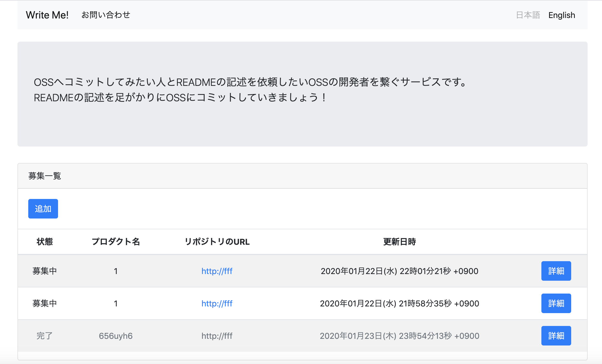

[](https://heroku.com/deploy?template=https://github.com/massongit/write_me)



# Write Me!
OSSへコミットしてみたい人とREADMEを記述して欲しいOSSの開発者を繋ぐサービス

## Ruby version
2.6.5

## 必要なソフトウェア・ライブラリ
* rbenv
* postgresql
* yarn
* Docker
* docker-compose

## 対応ブラウザ
* モバイル
	* Chrome for Android
		* 79
	* Firefox for Android
		* 68
	* QQ Browser
		* 1.2
	* UC Browser for Android
		* 12.12
	* Android Browser
		* 76
	* Baidu Browser
		* 7.12
	* iOS Safari
		* 13.3
		* 13.2
		* 13.0-13.1
		* 12.2-12.4
		* 12.0-12.1
		* 11.3-11.4
		* 10.3
	* KaiOS Browser
		* 2.5
	* Opera Mini
		* all
	* Opera Mobile
		* 46
	* Samsung Internet
		* 10.1
		* 9.2
* PC
	* Chrome
		* 79
		* 78
		* 49
	* Edge
		* 79
		* 18
	* Firefox
		* 72
		* 71
		* 68
	* Internet Explorer
		* 11
	* Opera
		* 64
		* 63
	* Safari
		* 13
		* 12.1

## 開発環境構築方法
1. rbenvでRubyをインストールします。
    ```sh
    $ rbenv install 2.6.5
    ```

1. シェルでのRubyをインストールしたRubyに切り替えます。
    ```sh
    $ rbenv shell 2.6.5
    ```

1. 必要なライブラリをインストールします。
    ```sh
    $ bundle install
    ```

1. 以下のように `.env` ファイルを作成します。
    ```.env
    POSTGRES_USER={DBのユーザーID (任意)}
    POSTGRES_PASSWORD={DBのパスワード (任意)}
    ```

1. Dockerコンテナ (DB) を立ち上げます。
    ```sh
    $ docker-compose up -d
    ```

1. DBのマイグレーションを行います。
    ```sh
    $ bundle exec rake db:create db:migrate
    ```

1. サーバーを起動します ( http://localhost:3000/ へアクセスするとサイトが表示されます)。
    ```sh
    $ bundle exec rails s
    ```
